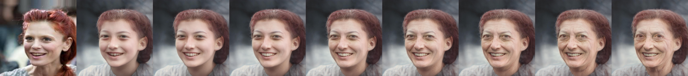
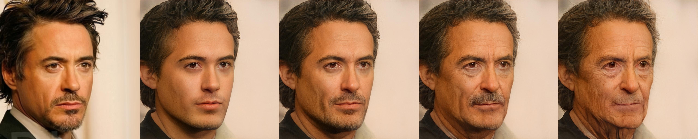
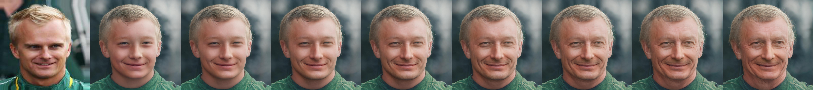

# SAM-Paddle
PaddlePaddle Implementation for "[Only a Matter of Style: Age Transformation Using a Style-Based Regression Model](https://paperswithcode.com/paper/only-a-matter-of-style-age-transformation)" (SIGGRAPH 2021)

数据集： CelebA 下载地址：http://mmlab.ie.cuhk.edu.hk/projects/CelebA.html

验收标准： CelebA 人眼评估生成的图像（可参考论文中展示的生成图片 Figure 4，6，8）

官方开源的代码和预训练模型：
| Path | Description |
| --- | --- | 
[CODE: SAM](https://github.com/yuval-alaluf/SAM) | the Official Implementation in PyTorch 
[MODEL: SAM](https://drive.google.com/file/d/1XyumF6_fdAxFmxpFcmPf-q84LU_22EMC/view?usp=sharing) | SAM trained on the FFHQ dataset for age transformation.

---


论文中官方实验结果：


官方(pytorch)代码复现结果：





## 运行预测
下载官方的预训练模型放在checkpoints目录下，再到options目录下更改`test_options.py`中相应的模型、源图片和输出结果(`exp_dir`)路径，之后使用scripts/inference_side_by_side.py对一组图像进行预测。
例如：
```shell
python scripts/inference_side_by_side.py
```
不用在终端使用`--`来指定参数，因为已经写在`test_options.py`中。
